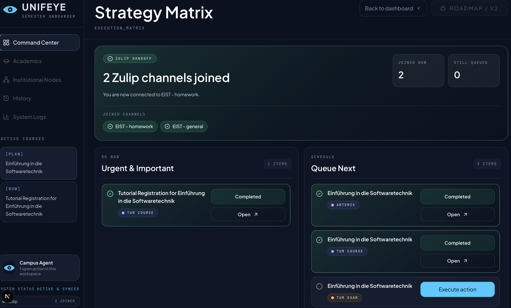
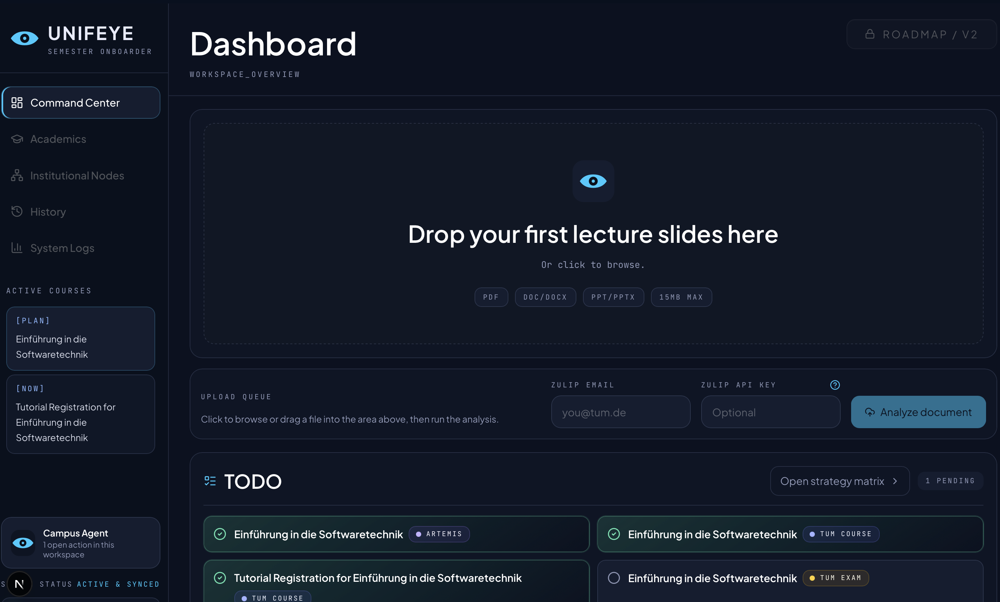

# Unifeye: Your Automated Semester Onboarder

Unifeye is an intelligent "semester onboarder" command center. Designed to eliminate the administrative friction at the start of every semester, Unifeye acts as your personal agent, taking your course material and automatically turning it into an executed action plan. 

Simply upload your organizational slides (from Moodle or Artemis), and Unifeye reads the content, extracts the logistics, and creates a prioritized checklist. But it doesn't stop there—it acts on these tasks for you, such as automatically joining the required Zulip channels, directing you to Artemis course lists, and generating pre-filled search queries for instant TUMonline registration.

<div align="center">
  
</div>

## ✨ Key Features

### 📄 1. Document Ingestion
- Accepts documents uploaded directly by the user (e.g., course briefs, project specs, organizational syllabi).
- Intelligently parses and processes the noisy slide content to extract actionable student logistics.
- Supports multiple document formats for flexible input.

### ⚖️ 2. Eisenhower Matrix Prioritisation via LLM
- Normalizes extracted document content into a structured, actionable checklist.
- Runs the checklist through an LLM to intelligently classify each task.
- Presents output as a student-adapted Eisenhower Matrix across 2 active quadrants:
  - **🔴 Do Now (Urgent & Important):** Act immediately, highest priority.
  - **🟡 Schedule (Not Urgent but Important):** Plan ahead and allocate dedicated time.
- Dynamically re-scores and updates tasks as new documents are uploaded or as tasks are executed.

<div align="center">
  
</div>

### 💬 3. Zulip Channel Integration
- Connects to and joins relevant module Zulip channels automatically based on extracted data.
- Pulls in tasks, updates, and team communications in real time.
- Feeds channel activity into the prioritization pipeline for a unified, centralized task view.

### 🎓 4. Artemis Course Integration
- Automatically identifies relevant Artemis courses based on extracted tasks and module requirements.
- Simplifies enrollment by providing a centralized link to the active Artemis course list, enabling you to quickly find and join your courses in just a few clicks.
- Eliminates the friction of searching for the registration portal manually.

### 🔍 5. TUMonline Course & Exam Discovery
- Intelligently parses your module details to extract the most effective search query for TUMonline.
- Generates pre-filled search links that take you directly to the results page with your course or exam already typed in.
- Saves you the hassle of manually navigating the TUMonline legacy search interface, bridging the gap between your checklist and actual registration.

---

## 🎥 Demo

Check out the product in action: [Watch Demo Video (demo.mov)](screenshots/demo.mov)

---

## 🛠 Technical Setup

### Run locally

```bash
npm install
cp .env.example .env.local
npm run dev
```

### Dify Backend Setup (AI Intelligence)

The core logic of Unifeye is powered by a Dify workflow. To set it up:

1.  **Import Blueprint:** Import the `dify_blueprints/Unifeye.yml` file into your [Dify](https://dify.ai/) workspace.
2.  **API Key:** Once imported, go to the **API Access** section in Dify, generate an API Key, and add it to your `.env.local` as `DIFY_API_KEY`.
3.  **API URL:** Set `DIFY_API_URL` to your Dify instance URL (e.g., `https://api.dify.ai/v1/workflows/run`).

### Required environment variables

Set these in `.env.local` for local work, and in your hosting provider's server-side environment settings for production:

- `DIFY_API_URL`
- `DIFY_API_KEY`

These are optional depending on your workflow:

- `DIFY_USER_ID`
- `DIFY_INPUT_ZULIP_EMAIL`
- `DIFY_INPUT_ZULIP_API_KEY`
- `ZULIP_REALM_URL`
- `ZULIP_SUBSCRIPTIONS_URL`
- `ZULIP_EMAIL`
- `ZULIP_API_KEY`

### Secret safety

- Real keys stay in `.env.local` or your deployment platform's secret store.
- `.env*` files are ignored by git; only `.env.example` is tracked.
- Server-side env access is centralized in `lib/server-env.ts`, which rejects `NEXT_PUBLIC_` names for secrets.
- Do not place API keys in client components, `NEXT_PUBLIC_*` variables, or committed config files.

### Scripts

```bash
npm run dev
npm run build
npm run lint
```

### Deploy

Before deploying, add the required environment variables in your production platform and verify they are configured as server-only secrets.